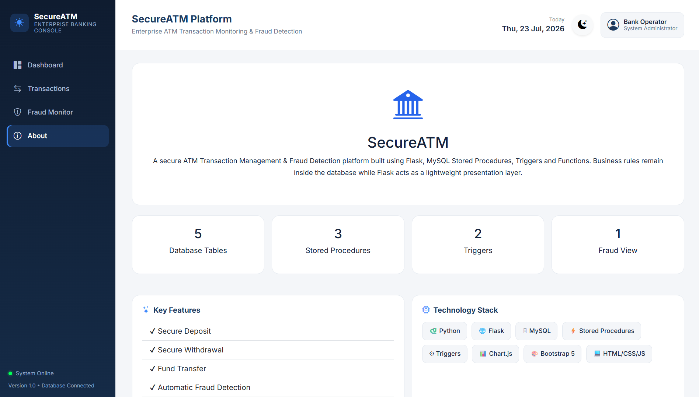
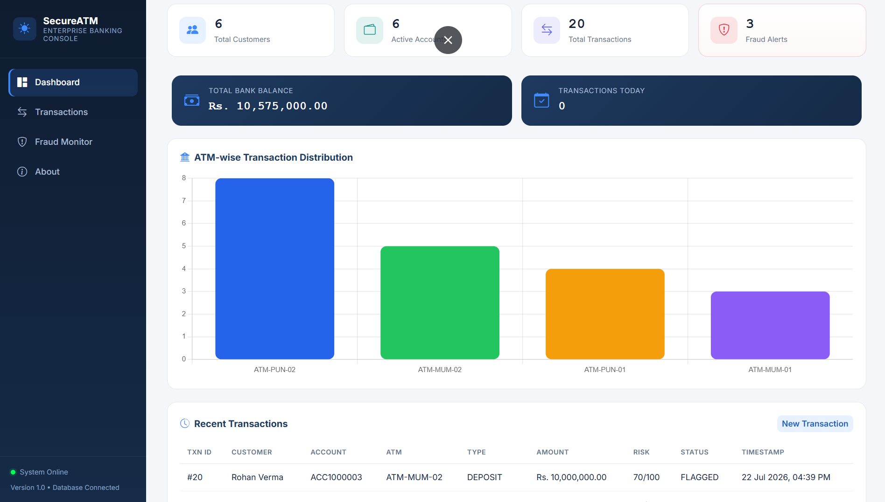
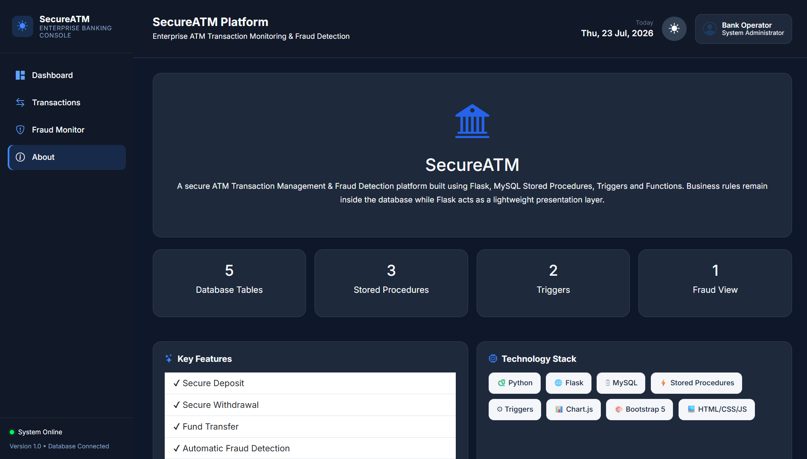
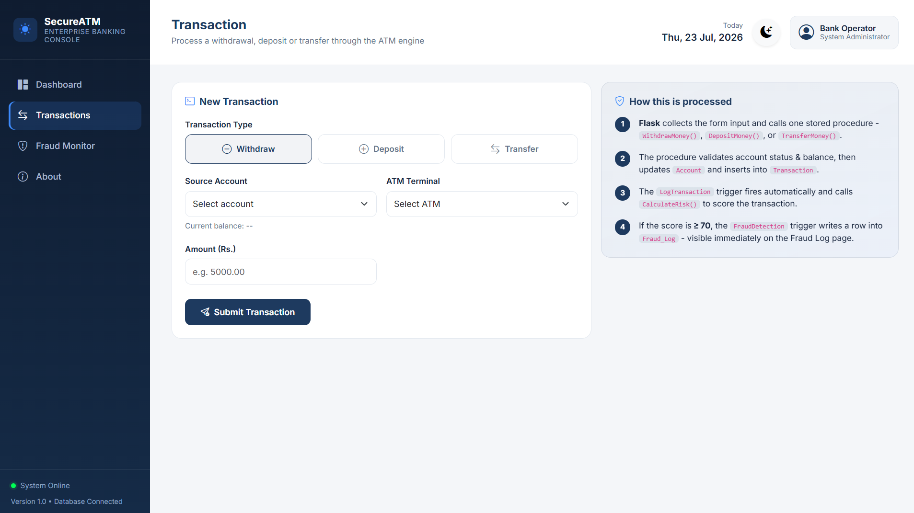
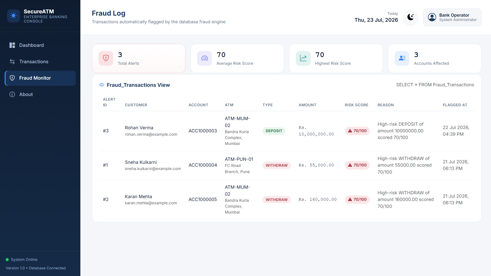

# 💳 # 💳 ATM Transaction Management & Fraud Detection System

A modern Flask + MySQL based ATM Transaction Management & Fraud Detection System with real-time analytics dashboard.

---

## 🚀 Features

- Secure ATM Transactions
- Deposit & Withdraw
- Money Transfer
- Fraud Detection
- Transaction History
- Admin Dashboard
- Dark Mode
- Charts & Analytics

---

## 🛠️ Tech Stack

- Python
- Flask
- MySQL
- HTML5
- CSS3
- JavaScript
- Bootstrap 5
- Chart.js

---

## 📂 Project Structure

```text
ATM-Fraud-System/
│
├── app.py
├── config.py
├── db.py
├── sql/
├── static/
└── templates/
```

---

## ⚙️ Installation

```bash
git clone <repo-url>

pip install -r requirements.txt

python app.py
```

---

## 📸 Screenshots

## 📸 Screenshots

| About | Dashboard |
|--------|-----------|
|  |  |

| Dark Mode | Transactions |
|------------|--------------|
|  |  |

| Fraud Monitor |
|---------------|
|  |

---

<table>
<tr>
<td></td>
<td></td>
</tr>

<tr>
<td></td>
<td></td>
</tr>

<tr>
<td colspan="2" align="center">

</td>
</tr>
</table>

## ⭐ Project Highlights

- Flask-based web application
- MySQL database with Stored Procedures, Functions, Triggers & Views
- Responsive Bootstrap UI
- Fraud monitoring dashboard
- GitHub Actions CI

---

## 🚀 Future Enhancements

- Email notifications for suspicious transactions
- OTP verification
- Face authentication
- AI-based fraud prediction
- Docker deployment
- Cloud hosting

---

## 👨‍💻 Author

Samadhan Dhake
